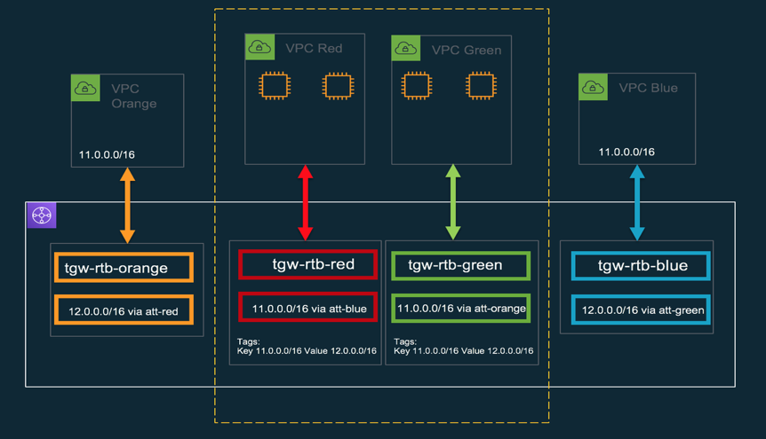

# Terraform solution for overlapping CIDRs using Transit Gateway in VPC and NAT instances

This repo is based on an [aws-sample](https://github.com/aws-samples/aws-transit-gateway-overlapping-cidrs).

It uses the same architecture and the terraform config is named by the colors on the architecture diagram. **Note**: The CIDR ranges in the config do not match diagram below.



## Testing

```sh
terraform apply --auto-approve
terraform output ssh-key > /tmp/ssh
chmod 600 /tmp/ssh
ssh -i /tmp/ssh ubuntu@$(terraform output poc-vpc-transit-orange-ip) 'ping -c 2 192.168.254.100'
ssh -i /tmp/ssh ubuntu@$(terraform output poc-vpc-transit-blue-ip) 'ping -c 2 192.168.254.100'
```

This tests ping in both direction from a deployed VM.
